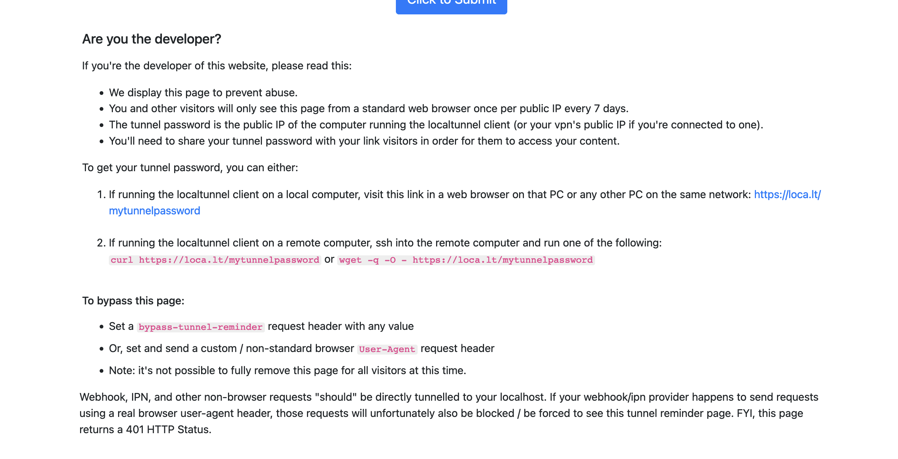

# Development Guide

## docs to refer to link db with clerk
```
https://clerk.com/blog/webhooks-getting-started
```

## Local Development Setup

1. Start the development server:
```bash
npm run dev
```
This starts the Next.js app on http://localhost:3000 using Turbopack.

2. For webhook testing, expose your local server using LocalTunnel in a separate terminal:
```bash 
npm run tunnel
```
This creates a public URL like `https://xyz123.loca.lt` that forwards to your local server.

### Custom LocalTunnel Subdomain

To use a custom subdomain, modify the tunnel script in package.json:

```json
"scripts": {
    "tunnel": "npx localtunnel --port 3000 --subdomain mysubdomain"
}
```

### LocalTunnel Setup Example



## Cron Job Setup Guide

Since Vercel doesn't support cron jobs directly, use one of these external services:

### Option 1: cron-job.org
1. Sign up at cron-job.org
2. Create a new cron job:
     - Set URL to your API endpoint
     - Configure weekly frequency
     - Set request method as GET
     - Add any required headers

### Option 2: EasyCron
1. Sign up at EasyCron
2. Configure a weekly cron job
3. Point to your API endpoint

### Option 3: Cloud Functions
Use AWS Lambda or Google Cloud Functions:
1. Create a cloud function
2. Set up weekly triggers
3. Configure the function to call your API endpoint

## Important Notes
- Keep your API endpoints and keys secure
- Test webhook integrations thoroughly
- Monitor cron job execution logs
- Configure proper error handling
